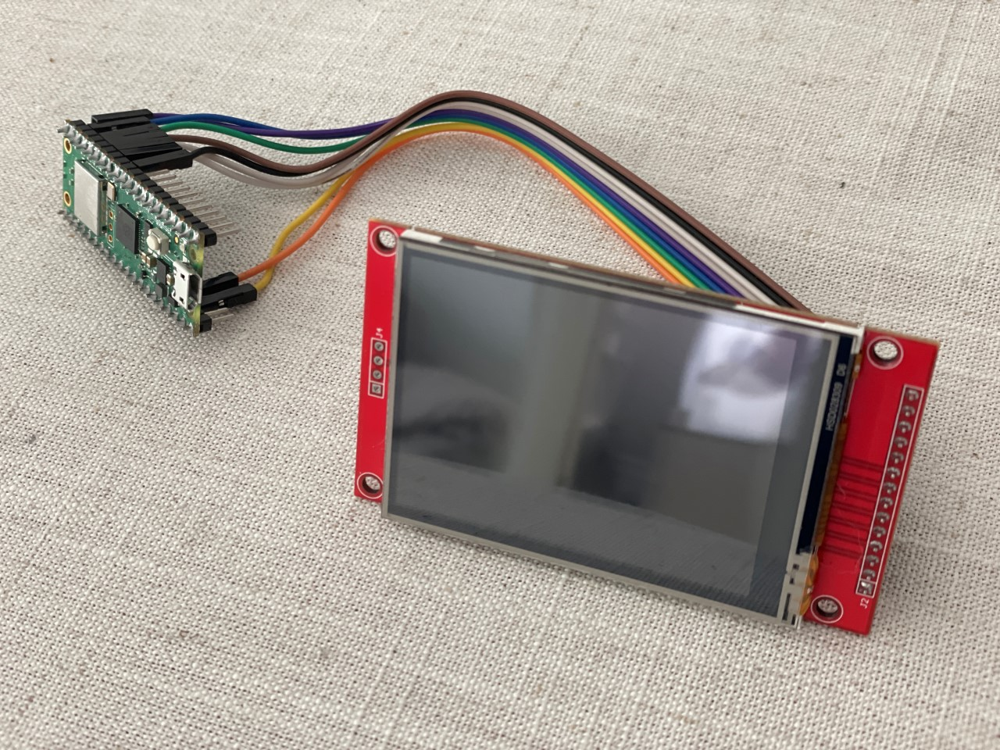
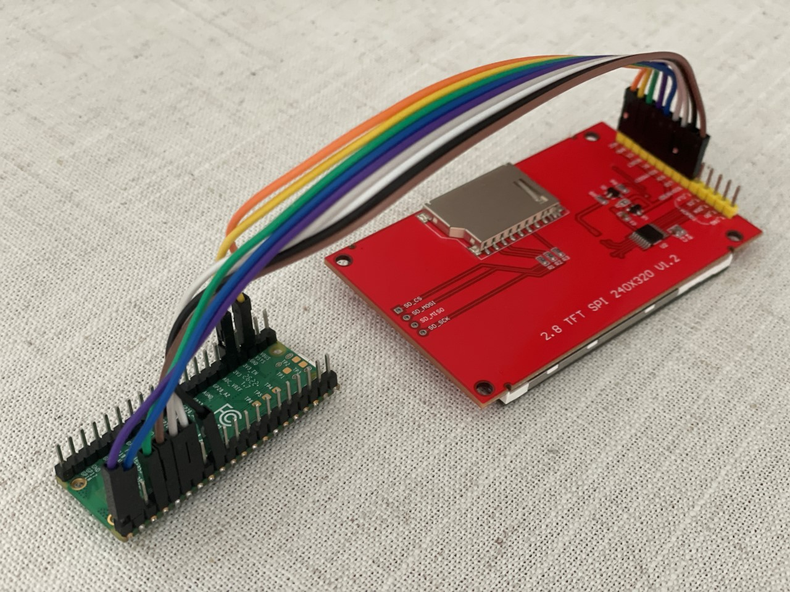
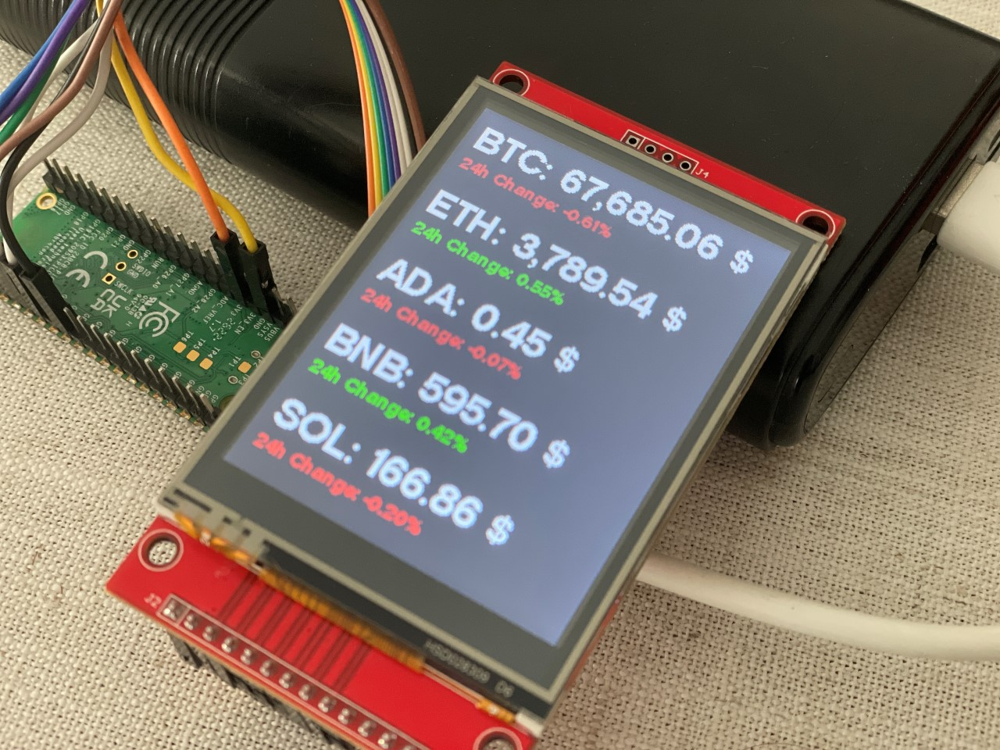
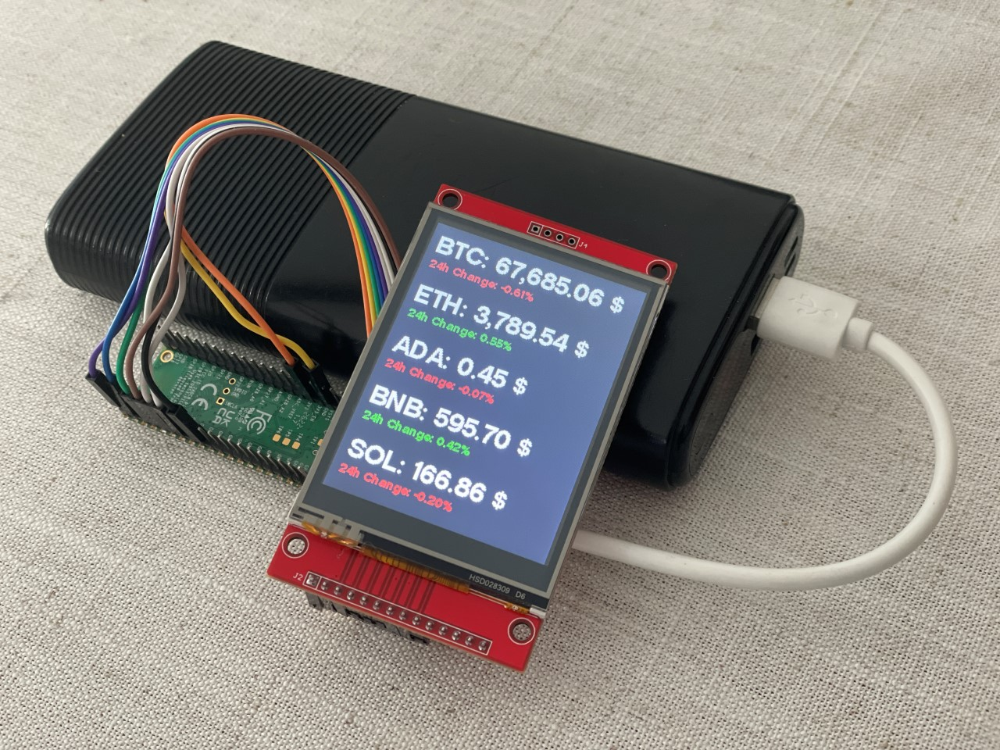
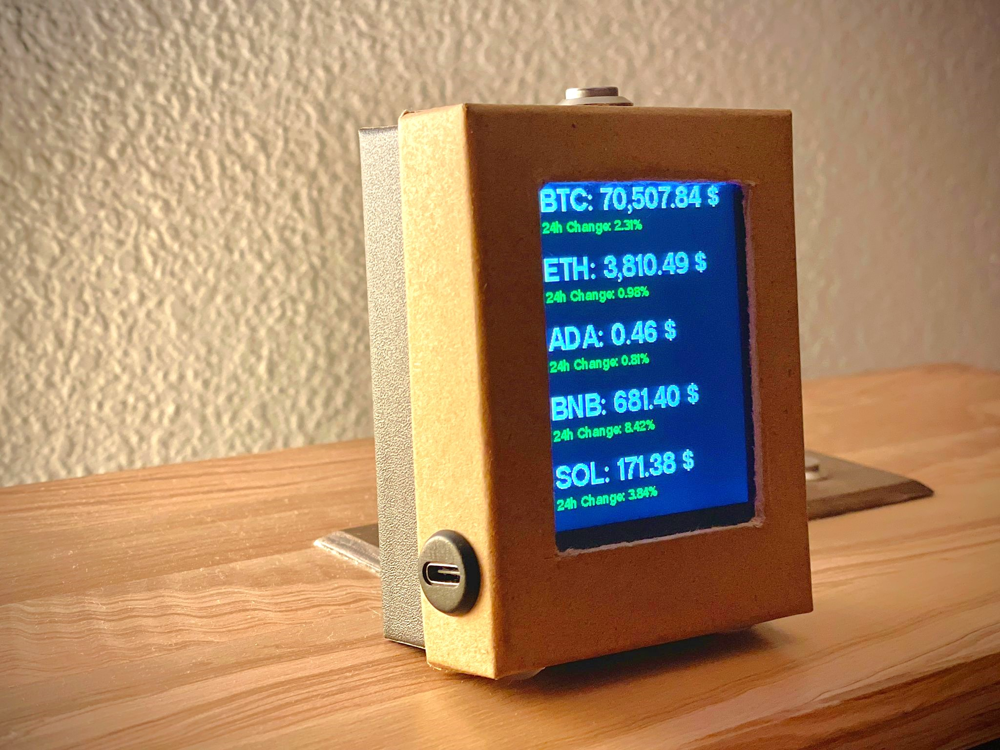
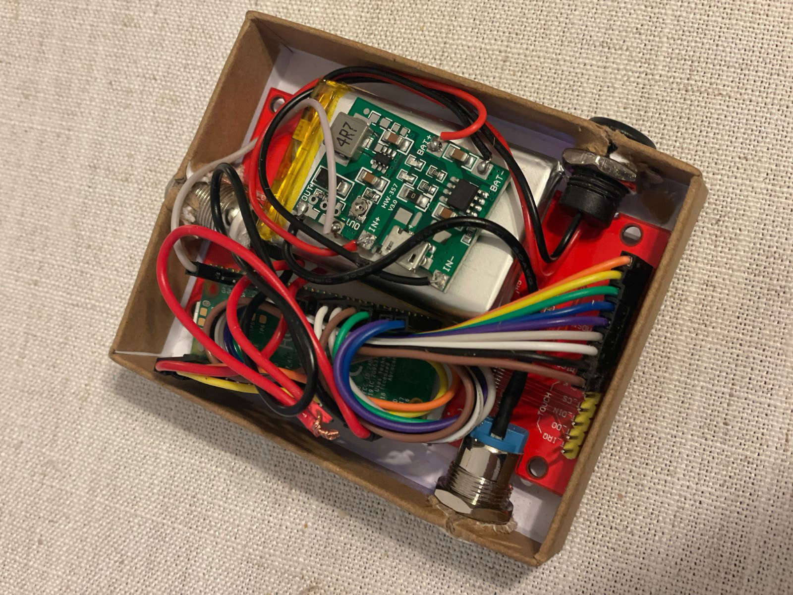

# CRYPTO DASHBOARD - Raspberry Pi Pico W (MicroPython)
Simple but beautiful Cryptocurrency Dashboard using the Binance API.
  
**Developed in MicroPython for Raspberry Pi Pico W**
  

  

  
And the fun part, the crypto cardboard box
  
Approximate budget:
 
Raspberry Pico - 7€
 
2.8" screen - 2€
 
Buttons - 2€
 
1,500mah battery - 4€
Cables, Upstep DC and case - 2€
 
**Total - 17 € / $ approx.**
  

  
Integrated support for 2.8" TFT LCD display (ili9341), driver included with simple sources.
  
**ILI9341 DRIVERS**
  
**https://github.com/jeffmer/micropython-ili9341/tree/master**
## WIFI CONFIGURATOR
In this mini app you have everything you need to configure the wifi connection of your RPi Pico W through an Access Point from another device.
 
When connecting, **a wifi_credentials.json** file will be created in which the SSID / Password information of your Wifi connection will be stored.
 
On the next reboot, the device will detect the stored connection and get the data from the Binance API.
 
And of course the simple Crypto Dashboard adapted to the ili9341 screen
  
As you can see in the code, GPIO 17 is configured for a button
 
With a single press you reload the Binance data
 
If you hold it down for more than 3 seconds the device is reset, deleting the stored json data (wifi_credentials.json and tokens.json)
 
Initially the device loads some default Tokens (BTC, ETH, ADA, BNB, SOL)

## INSTALL
In this case I'm using the RPi Pico W board, so you need to download the corresponding Firmware:
 
**https://rpf.io/pico-w-firmware**
  
First of all, have the Pico W disconnected.
Then hold down the BOOTSEL button on your Pico W while connecting it to the computer via USB.
A drive will appear on the computer, copy the downloaded Firmware file to the main directory, the device will reboot.
  
Now it's time to open your favorite MicroPython editor, in my case I like Thonny, since it's easy and efficient.
In Thonny go to Run-->Configure Interpreter
And select MicroPhyton (Raspberry Pi Pico)
  
Download the files from this repository and copy them to the root of your device using your code editor.
  
## ALL SET
Now you just have to RUN your code.
  
The main file "main.py" includes the code, you need to configure your device's wifi using an Access Point and the simple viewer to display the price of 5 cryptocurrencies adapted to the ili9341 screen.
  
If you have another screen model you simply have to find the appropriate drivers and configure the parameters in main.py (TFT screen configuration)
  

## TO DO
- [x] Include GPIO Button to Refresh Crypto Data
- [x] Include GPIO Button to re-enable Wifi Access Point
- [x] Crypto customizer via Access Point
- [ ] Include mini crypto logos

## KWON BUGS
- [ ] Fix update data via Access Point from iOS
- [ ] Increase screen draw performance
